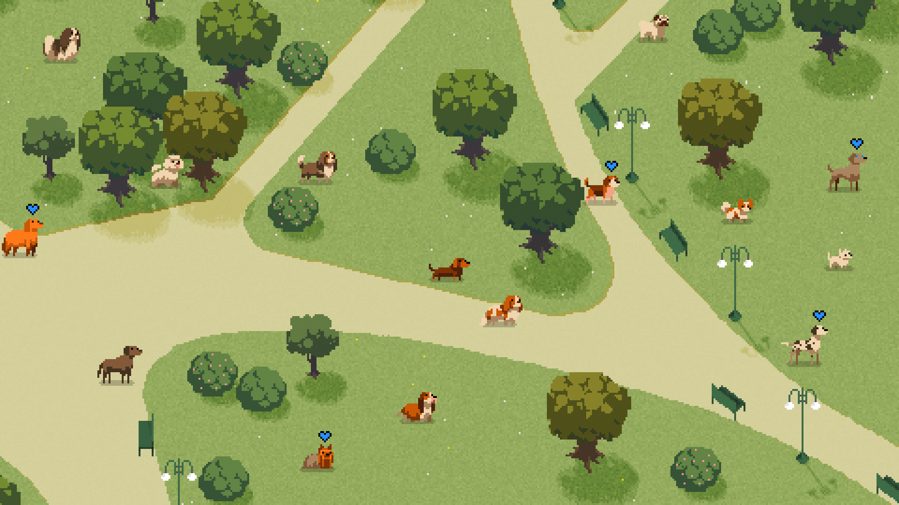

### Un’app per “collezionare” i cani che si incontrano durante la passeggiata quotidiana al Parco Sempione, favorendo la socialità e l’educazione tra padroni all’Area Cani di Parco Sempione.

L’applicazione permette di creare una card del proprio amico a quattro zampe e renderla condivisibile con gli altri padroni.  

---

## Come installare WAGGLE

#### NB:

- L'app funziona solo su Android
- È ancora un prototipo per tanto non tutte le funzioni sono disponibili (ma lo saranno presto!)

---

#### Modalità super-friendly   (server online pubblicato su render.com)

1. Apri Chrome dal tuo dispositivo mobile
2. Cerca il sito https://waggle.onrender.com
3. Naviga il sito online e divertiti :)
4. Se l'esperienza è indimenticabile, clicca su tre puntini in alto alla pagina e aggiungi una scorciatoia alla schermata home
5. Installa WAGGLE e conosci nuovi amici <3

---

#### Modalità mostly-coders   (server locale)

1. Installa node da https://nodejs.org/
2. Clona la repository Github
3. Apri la cartella in Visual Studio Code  
   (se non possiedi questo editor di testo lo puoi scaricare al seguente link https://code.visualstudio.com/)
4. Apri il terminale
5. Installa tutte le node dependencies tramite il comando `npm install`
6. Lancia il server in locale tramite il comando `node server.js`
7. Lancia il comando `npx serve` per aprire un tunnel utilizzando Microsoft Dev Tunnels
8. Dal menù del terminale seleziona `PORTE` e seleziona `Forward a Port`
9. Inserisci il numero della porta, `3000`, e attendi l'apertura del tunnel
10. CLick destro sul link della porta e seleziona `visibilità della porta` per cambiare da `privata` a `pubblica`.
11. Copia il link dell'app e condividilo con tutti :))))

( se i passaggi per l'apertura del local tunnel non fossero chiari, al seguente link viene spiegato il processo passo passo
https://code.visualstudio.com/docs/editor/port-forwarding )

---

## 

---

## Crediti

I bellissimi asset dei cani non sono nostri ma della pixel artist Shosa. 
Di seguito il link per risalire alle immagini originali e per vedere tutti i suoi incredibili lavori <3
https://collet66.web.fc2.com/gallery/dogs/dogs.html  

---

## 

---

## Contesto

Il progetto è stato sviluppato all'interno del Laboratorio di Sistemi per l’interazione a.a. 2023/24, parte del corso di Laurea Magistrale in Design della Comunicazione del Politecnico di Milano.

#### Autori

Andrea Brolatti 
Marco Convento 
Martina Esposito 
Anita Ruggiu 

#### Docenti

Emanuele Della Valle 
Marco Quaggiotto 
Maria Tasca 
Matteo Valoriani 

---

## 

---
